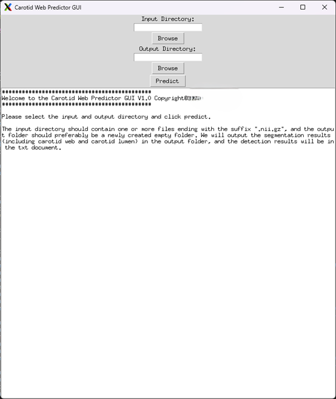

# CaW-Segmentation-and-Detection
This repo contains the official codes and tools for manuscript “A Two-Stage Convolutional Neural Network for Segmentation and Detection of Carotid Web on CT Angiography” submitted to Journal of NeuroInterventional Surgery.
***
## Software distrubution
We provide three methods for testing, all of which provide Google Cloud links. If it is in dicom format, please use the provided script to convert it to nii.gz. The three methods are as follows:
1. Source code:
Click [here](https://drive.google.com/file/d/1LKMaxlG8S3UwGBubcuK6AnsN_leEHlVq/view?usp=drive_link) for the source code of the project.
2. Linux distribution
Click [here](https://drive.google.com/file/d/13Gpc-xJLWFl2qltfe9p8ZMPD3d9mF0j3/view?usp=sharing) for the Linux compiled executable program.
3. Windows distribution
Click [here](https://drive.google.com/file/d/1NgawcAJv8YqSFy2Pz1o-K5hkqqXJoA6T/view?usp=sharing) for the Windows compiled executable program.

Testing platform:
> **Windows**: win11, 16GB RAM, RTX3060 12GB VRAM. At least 6GB of video memory is recommended.
> **Linux**: Test environment, Ubuntu 20.04.3 LTS. The performance of general servers is relatively high and basically sufficient. 6GB of video memory is at least required.


## How to use the software (3 ways)
### The source code runs as follows:
Unzip CaW_Predictor_source_code.rar under linux or windows.
The two scripts pointed by the arrows are used to batch convert .dcm to .nii.gz and batch predict .nii.gz respectively.

1. First run convert_dicom_to_nii_gz.py to convert the file format. Note that the batch file format conversion operation needs to be modified to a specific path.
2. If it is already a file in nii.gz format, then
```bash
cd nnUNet
pip install -e .
```
Then `Run predict_from_raw_data.py`

Tips:
[Optional] If you accidentally installed the CPU version, execute the following command `
pip install torch==2.0.0+cu117 torchvision==0.15.1+cu117 torchaudio==2.0.1 --index-url https://download.pytorch.org/whl/cu117 `
[Optional] If the error message shows that the package is not found, just pip install the corresponding package.

### The Linux executable program runs as follows:
Download and extract dist_linux.rar


Then execute the following command:
```bash 
chmod 777 dist_linux
./dist_linux
```

### The Windows executable program runs and detailed outputs as follows:
Download and extract dist_windows.rar


The software opening interface is as shown in the figure below. Browse the corresponding input and output folders. Be careful not to have Chinese characters in the path. Click predict to start working.


As shown in the figure below, the front-end GUI interface may become unresponsive due to hardware configuration issues, full memory or multi-threading issues. I tested it on high-performance Ubuntu without any problems, but I experienced unresponsiveness on my personal windows. At this time, you can wait patiently for the program to finish executing in the background. Do not close the background console window. The two progress bars represent the two files being predicted.


The interface after normal execution is as shown below.


As shown in the figure below, my input directory is E:\Master's Code\nnUNet_raw\Dataset138_CaW\imagesTs (choose independently), and there are multiple nii.gz files in the directory. My example here is two files that need to be predicted. The output directory is my newly created predictions directory (preferably an empty directory).


After executing the program (it may take a long time, covering pre-processing, prediction test enhancement, post-processing and other operations, if necessary, I can expose more interface parameters to adjust the running time), as shown below, generated Two corresponding prediction results and a carotid web detection document are obtained.
Taking the case qc17_msk_0000.nii.gz as an example, the first and second pictures below represent the results of our method and the results marked by doctors respectively. The color does not correspond completely because the doctor divides the voxel labeling into left and right. This case was bilateral CaW. The test results showed that both cases had carotid web, which was consistent with the conclusion given by the doctor's label.


As shown in the figure below, if a new sample is added to the test, you only need to copy the new sample to the originally selected input directory, and the software will automatically detect which files have not yet been predicted.


